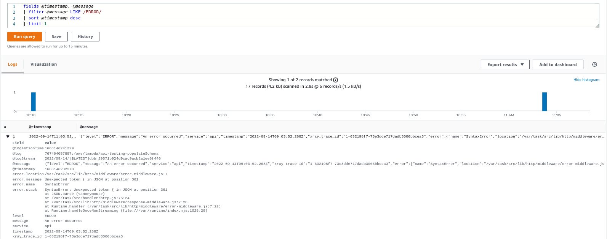

# AWS Lambda Skeleton

<div id="top"></div>

<!-- PROJECT SHIELDS -->
<!--
*** I'm using markdown "reference style" links for readability.
*** Reference links are enclosed in brackets [ ] instead of parentheses ( ).
*** See the bottom of this document for the declaration of the reference variables
*** for contributors-url, forks-url, etc. This is an optional, concise syntax you may use.
*** https://www.markdownguide.org/basic-syntax/#reference-style-links
-->

<!-- TABLE OF CONTENTS -->
  <ol>
    <li>
      <a href="#about">About The Project</a>
      <ul>
        <li><a href="#built-with">Built With</a></li>
      </ul>
    </li>
    <li>
      <a href="#getting-started">Getting Started</a>
      <ul>
        <li><a href="#prerequisites">Prerequisites</a></li>
        <li><a href="#installation">Installation</a></li>
      </ul>
    </li>
    <li><a href="#usage">Usage</a></li>
    <li><a href="#roadmap">Roadmap</a></li>
    <li><a href="#contributing">Contributing</a></li>
    <li><a href="#license">License</a></li>
  </ol>


<!-- ABOUT THE PROJECT -->

## <a name="about"></a> About The Project

This is an AWS Lambda boilerplate to get you up and running quickly.

<p align="right">(<a href="#top">back to top</a>)</p>

### <a name="built-with"></a> Built With

[![Node][Node.js]][Node-url] [![Typescript][Typescript]][Typescript-url] [![JEST][Jest]][JEST-url] [![ESLINT][Eslint]][ESLINT-url] [![Serverless Framework][Serverless]][Serverless-url]

<p align="right">(<a href="#top">back to top</a>)</p>


<!-- GETTING STARTED -->

## <a name="getting-started"></a> Getting Started

### <a name="prerequisites"></a> Prerequisites

Make sure you have Node 16 and serverless framework installed:

- https://nodejs.org/en/download/
- https://www.typescriptlang.org/download

### <a name="installation"></a> Installation

Clone the repository:

```sh
git clone git@github.com:Edwin-Luijten/node-aws-lambda.git .
```

Install dependencies:

```shell
npm install
```

<!-- USAGE EXAMPLES -->

## <a name="usage"></a> Usage

<div id="usage"></div>
The skeleton comes with some handy functionality.

<ol>
    <li><a href="#tests">Tests</a></li>
    <li>HTTP
      <ul>
          <li><a href="#middleware">Middlewares</a>
            <ul>
              <li><a href="#middleware-error">Error middleware</a></li>
              <li><a href="#middleware-validation-error">Validation Error middleware</a></li>
              <li><a href="#middleware-response">Response middleware</a></li>
              <li><a href="#middleware-composing">Composing middlewares</a></li>
            </ul>
          </li>
          <li><a href="#response">Response</a></li>
          <li><a href="#validation">Validation Errors</a></li>
      </ul>
    </li>
    <li><a href="#encryption">Encryption</a></li>
    <li><a href="#hashing">Hashing</a></li>
    <li><a href="#s3-signed-upload-url">Uploads</a></li>
</ol>

### <a name="tests"></a> Tests

This skeleton comes with [Jest](https://jestjs.io/). And includes tests covering the lib folder.  
Run them by executing:

```shell
npm run test
```

_(by default it generates coverage in ./coverage, the html page can be found in: ./coverage/Icov-report)_
<p align="right">(<a href="#usage">back to usage</a>)</p>

## <a name="middleware"></a> Middlewares

### <a name="middleware-error"></a>Error Middleware

The error middleware will catch the uncaught error and transforms it to a readable response.  
In order to log (optional argument) the error it makes use of [@aws-lambda-powertools/logger](https://awslabs.github.io/aws-lambda-powertools-typescript/latest/core/logger/)

#### Example

```typescript
import HttpStatusCode from '../lib/http/code';
import Response from '../lib/http//response';
import { errorHandler } from './error-middleware';
import { Logger } from '@aws-lambda-powertools/logger';

const logger = new Logger({serviceName: 'api'});    

export const ping: APIGatewayProxyHandler = errorHandler(logger)(async (event: APIGatewayProxyEvent, context) => {
    throw new Error('Oops');

    return (new Response('pong')).send();
});
```

Example Response:

```json
{
  "code": 500,
  "message": "Internal server error"
}
```


Log Insights query example:
```
fields @timestamp, @message
| filter @message LIKE /ERROR/
| sort @timestamp desc
| limit 1
```


<p align="right">(<a href="#usage">back to usage</a>)</p>

### <a name="middleware-validation-error"></a>Validation Error Middleware

The validation error middleware will catch the ValidationError from joi and transforms it to a better format.

#### Example

```typescript
import HttpStatusCode from '../lib/http/code';
import Response from '../lib/http//response';
import { validationErrorHandler } from './validation-error-middleware';

export const ping: APIGatewayProxyHandler = validationErrorHandler()(async (event: APIGatewayProxyEvent, context) => {
    const {error} = Joi.object({
        email: Joi.string().email(),
    }).validate({
        email: 'foo',
    });

    if (error) throw error;

    return (new Response('pong')).send();
});
```

Example Response:

```json
// HTTP Status code: 400
{
  "error": {
    "code": "error.form.validation",
    "message": "Not all fields are filled correctly.",
    "fields": [
      {
        "field": "email",
        "code": "error.string.email",
        "message": "\"email\" must be a valid email"
      }
    ]
  }
}
```

<p align="right">(<a href="#usage">back to usage</a>)</p>

### <a name="middleware-response"></a>Response Middleware

The response middleware makes sure a valid json response will be returned.

#### Example

```typescript
import HttpStatusCode from '../lib/http/code';
import Response from '../lib/http//response';
import { responseHandler } from './response-middleware';

export const ping: APIGatewayProxyHandler = validationErrorHandler()(async (event: APIGatewayProxyEvent, context) => {
    // The middleware will call .build upon return
    return new Response(HttpStatusCode.OK, 'pong');

    // ApiGatewayProxyResult will just be retured
    return {
        statusCode: HttpStatusCode.OK,
        headers: {
            'Content-Type': 'application/json',
            'Cache-Control': 'no-cache, no-store, must-revalidate',
        },
        body: JSON.stringify({data: {foo: 'bar'}}),
    }

    // Any other object will be transformed to a valid ApiGatewayProxyResult
    //{
    //      statusCode: HttpStatusCode.OK, 
    //      headers: {
    //          'Content-Type': 'application/json',
    //          'Cache-Control': 'no-cache, no-store, must-revalidate',
    //      },
    //      body: '{"data": {"foo": "bar"}}',
    //}
    return {
        foo: 'bar'
    }

    // A simple return or undefined results in a no content response
    //{
    //      statusCode: HttpStatusCode.NO_CONTENT, 
    //      headers: {
    //          'Content-Type': 'application/json',
    //          'Cache-Control': 'no-cache, no-store, must-revalidate',
    //      },
    //      body: '',
    //}
    return
});
```

<p align="right">(<a href="#usage">back to usage</a>)</p>

### <a name="middleware-composing"></a>Composing Middlewares

Using multiple middleware is easy with the `composeHandler`.  

#### Example

```typescript
import HttpStatusCode from '../lib/http/code';
import Response from '../lib/http//response';
import { composeHandler } from './compose';
import { errorHandler } from './error-middleware';
import { validationErrorHandler } from './validation-error-middleware';
import { responseHandler } from './response-middleware';
import { APIGatewayProxyResult, APIGatewayProxyEvent, Context } from 'aws-lambda';

export const ping: APIGatewayProxyHandler = composeHandler(
        errorHandler(),
        validationErrorHandler(),
        responseHandler(),
        // Your handler
        (event: APIGatewayProxyEvent, context: Context): Promise<APIGatewayProxyResult> => (new Response(HttpStatusCode.OK, {pong: 'ok'}))
);
```

The outermost handler will be called before the handler starts, and the last when the handler is done or throws an error.  
A middleware that transforms the incoming request will be called from top to bottom, and a middleware that transforms the output will be called from the bottom to the top.
```
errorHandler
  validationErrorHandler
    responseHandler
      [ your handler ]
    responseHandler
  validationErrorHandler
errorHandler
```
<p align="right">(<a href="#usage">back to usage</a>)</p>

### <a name="response"></a> Response

#### Example

```typescript
import HttpStatusCode from '../lib/http/code';
import Response from '../lib/http//response';

const response = new Response();

// Adding headers `header(name, value)`
return response
    .status(HttpStatusCode.OK)
    .with({foo: 'bar'}) // Will be wrapped in a data attribute: { data: { foo: 'bar' } }
    .header('Cache-Control', 'public, max-age=300')
    .build();

// Setting cache duration `cache(duration)`
return response
    .status(HttpStatusCode.OK)
    .with({foo: 'bar'}) // Will be wrapped in a data attribute: { data: { foo: 'bar' } }
    .cache(300) // adding false will make it a private cache
    .build();

// Using the constructor only
return new Response(HttpStatusCode.OK, {foo: 'bar'}, 500).build();
```

<p align="right">(<a href="#usage">back to usage</a>)</p>

### <a name="validation"></a> Validation Errors

Uses [JOI](https://joi.dev/).

#### Example

```typescript
import HttpStatusCode from './code';
import { transformErrors } from './validation';

const {error, value} = Rules.eventRegistration.validate({
    title: input.name,
    name: input.name,
    surname: input.name,
    email: input.email,
    city: input.city,
}) as { error: ValidationError, value: EventRegistration };

if (error) {
    // The response utility will transform the Joi.ValidationError.
    return response.code(HttpStatusCode.BAD_REQUEST).with(error).send();
    // Otherwise you can use `transformError(error)`
    const errors = transformErrors(error);
}
```

Example Response:

```json
{
  "error": {
    "code": "error.form.validation",
    "message": "Not all fields are filled correctly.",
    "fields": [
      {
        "field": "email",
        "code": "error.string.email",
        "message": "\"email\" must be a valid email"
      }
    ]
  }
}
```

<p align="right">(<a href="#usage">back to usage</a>)</p>

### <a name="encryption"></a> Encryption

Required environment variables:

- HEX_ENCRYPTION_KEY

#### Example

```typescript
import { encrypt, decrypt } from '../lib/crypto';

const encrypted = encrypt('foo');
const decrypted = decrypt(encrypted);

```

<p align="right">(<a href="#usage">back to usage</a>)</p>

### <a name="hashing"></a> Hashing

Required environment variables:

- HASHING_KEY

#### Example

```typescript
import { hash, equals } from '../lib/hash';

const hashed = hash('foo');
const test = 'hashed string';

// contant-time hash comparison
if (equals(hashed, test)) {
    console.log('equal');
} else {
    console.log('not equal');
}
```

<p align="right">(<a href="#usage">back to usage</a>)</p>

### <a name="s3-signed-upload-url"></a> S3 Signed Upload Url

Required environment variables:

- AWS_REGION
- S3_BUCKET

#### Example

```typescript
import { S3 } from 'aws-sdk';
import { Ext, signedUploadUrl, Size } from '../lib/signed-upload-url';

const s3 = new S3({region: process.env.AWS_REGION});
const key = `social/${uuid}.${Ext.JPG}`;
const expiration = 500;

// Based on the key extension it sets the starts-with condition.
const url = await signedUploadUrl(s3, key, expiration, Size.ONE_MB);
console.log(url);
```

<p align="right">(<a href="#usage">back to usage</a>)</p>

<!-- ROADMAP -->

## <a name="roadmap"></a> Roadmap

- [x] Transform JOI validation errors to
  Media.Monks [spec](https://github.com/mediamonks/documents/blob/master/rest-api-specification.md#223-validation-error)

<p align="right">(<a href="#top">back to top</a>)</p>

<!-- CONTRIBUTING -->

## <a name="contributing"></a> Contributing

If you have a suggestion that would make this better, please fork the repo and create a pull request. You can also
simply open an issue with the tag "enhancement".

1. Fork the Project
2. Create your Feature Branch (`git checkout -b feature/AmazingFeature`)
3. Commit your Changes (`git commit -m 'Add some AmazingFeature'`)
4. Push to the Branch (`git push origin feature/AmazingFeature`)
5. Open a Pull Request

<p align="right">(<a href="#top">back to top</a>)</p>


<!-- LICENSE -->

## <a name="licence"></a> License

Distributed under the MIT License. See `LICENSE.txt` for more information.

<p align="right">(<a href="#top">back to top</a>)</p>


[//]: # (<!-- ACKNOWLEDGMENTS -->)

[//]: # ()

[//]: # (## <a name="acknowledgements"></a> Acknowledgements)

[//]: # ()

[//]: # (* []&#40;&#41;)

[//]: # (* []&#40;&#41;)

[//]: # (* []&#40;&#41;)

[//]: # (<p align="right">&#40;<a href="#top">back to top</a>&#41;</p>)


<!-- MARKDOWN LINKS & IMAGES -->
<!-- https://www.markdownguide.org/basic-syntax/#reference-style-links -->

[Node.js]: https://img.shields.io/badge/Node-35495E?style=for-the-badge&logo=node.js&logoColor=4FC08D

[Node-url]: https://nodejs.org

[Typescript]: https://img.shields.io/badge/TypeScript-007ACC?style=for-the-badge&logo=typescript&logoColor=white

[Typescript-url]: https://www.typescriptlang.org/docs/

[Serverless]: https://img.shields.io/badge/Serverless-35495E?style=for-the-badge&logo=serverless&logoColor=orange

[Serverless-url]: https://www.serverless.com/framework/docs

[JEST]: https://img.shields.io/badge/Jest-FF0000?style=for-the-badge&logo=jest&logoColor=white

[JEST-url]: https://jestjs.io/

[ESLINT]: https://img.shields.io/badge/Eslint-4B32C3?style=for-the-badge&logo=eslint&logoColor=white

[ESLINT-url]: https://eslint.org/